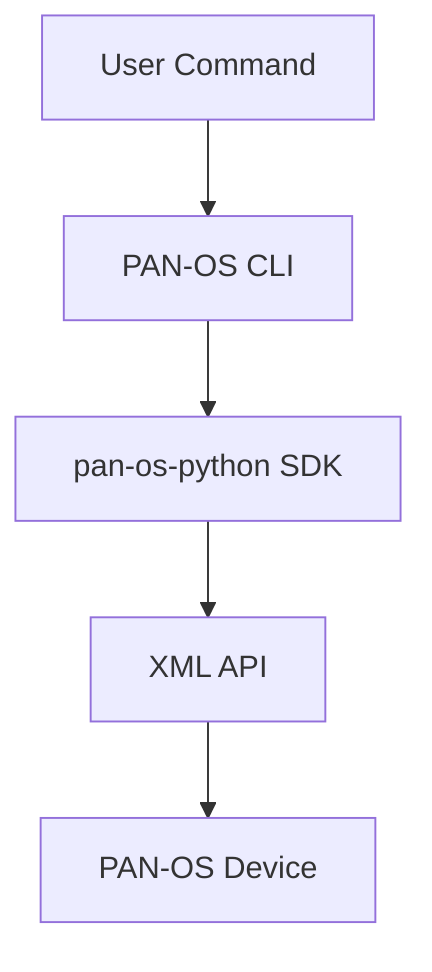

# Introduction

## What is PAN-OS CLI?

PAN-OS CLI is a command-line interface tool designed to simplify the management of Palo Alto Networks firewalls and Panorama appliances. It provides a powerful yet intuitive interface for performing various configuration tasks without having to navigate the web interface.

## Why Use PAN-OS CLI?

Managing Palo Alto Networks devices through the web interface can be time-consuming, especially when dealing with:

- Bulk operations (creating multiple objects)
- Repetitive tasks
- Automation requirements
- CI/CD integration

PAN-OS CLI addresses these challenges by providing a command-line tool that can be easily integrated into scripts, CI/CD pipelines, and other automation workflows.

## Key Benefits

- **Automation**: Easily automate common PAN-OS administrative tasks
- **Consistency**: Ensure consistent configuration across multiple devices
- **Speed**: Execute operations faster than through the web interface
- **Bulk Operations**: Configure multiple objects at once using YAML files
- **Documentation as Code**: Store your network configuration in version control
- **Integration**: Include in scripts and automation frameworks

## Architecture

PAN-OS CLI is built on top of the `pan-os-python` SDK and provides a high-level interface to the Palo Alto Networks XML API. The tool is designed with a modular structure that makes it easy to extend with new commands and functionality.

## Use Cases

- **DevOps Integration**: Incorporate PAN-OS configurations into your CI/CD pipeline
- **Bulk Management**: Quickly deploy multiple objects from a single YAML file
- **Audit and Compliance**: Generate reports and validate configurations
- **Migration**: Easily transfer configurations between devices
- **Automation**: Build custom workflows and scripts leveraging the CLI
